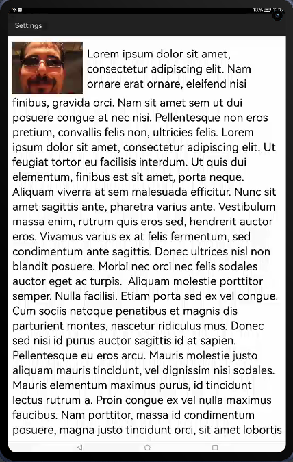

[](https://github.com/applibgroup/TextViewOverflowing/actions/workflows/main.yml)
[](https://sonarcloud.io/summary/new_code?id=applibgroup_TextViewOverflowing)
# TextViewOverflowing
TextViewOverflowing is a HMOS library that provides custom view and allows reflowing from one TextView to another.


## Source
Inspired by [JustinAngel/TextViewOverflowing](https://github.com/JustinAngel/TextViewOverflowing) 

## Feature
This library provides feature to allow reflowing TextView from one textview to another textview.

## Dependency
1. For using TextViewOverflowing module in sample app, include the source code and add the below dependencies in entry/build.gradle to generate hap/support.har.
```groovy
dependencies {
        implementation fileTree(dir: 'libs', include: ['*.jar', '*.har'])
        testImplementation 'junit:junit:4.13'
        ohosTestImplementation 'com.huawei.ohos.testkit:runner:1.0.0.100'
        implementation project(':textviewoverflow')
    }
```
2. For using TextViewOverflowing in separate application using har file, add the har file in the entry/libs folder and add the dependencies in entry/build.gradle file.
```groovy
dependencies {
        implementation fileTree(dir: 'libs', include: ['*.jar'])
        testImplementation 'junit:junit:4.13'
    }

```
3. For using TextViewOverflowing from a remote repository in separate application, add the below dependencies in entry/build.gradle file.
``` groovy
dependencies {
        implementation ('dev.applibgroup:textviewoverflowing:1.0.0') 
	testCompile 'junit:junit:4.13'
         }
```

## Usage

#### Xml

```xml
            <net.justinangel.textviewoverflow.TextViewOverflowing
                ohos:id="$+id:TextViewOverflowing"
                ohos:height="match_content"
                ohos:width="match_content"
                ohos:above="$+id:overflowTextView"
                ohos:align_parent_end="true"
                ohos:align_top="$+id:imageView"
                ohos:end_of="$+id:imageView"
                ohos:left_margin="12vp"
                ohos:multiple_lines="true"
                ohos:text="$string:SuperLongText"
                ohos:text_size="32fp"/>


```

#### Java
```java
TextViewOverflowing textViewOverflowing = (TextViewOverflowing)findComponentById(ResourceTable.Id_TextViewOverflowing);
textViewOverflowing.setOverflowTextViewId(ResourceTable.Id_overflowTextView);
```


### License 
Do whatever you'd like with this code. ("MIT license") 

